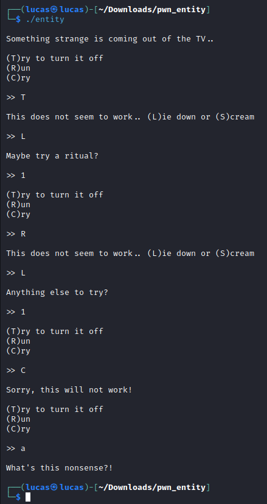

# Entity
Esse write-up será sobre sobre o desafio Entity do CTF Hack The Boo feito pelo Hack the Box para o Halloween.

## Sobre

Nesse desafio havia um arquivo zip para ser baixado e um docker que poderia ser ligado. O zip possuia um executável (ELF), um código escrito em C e um  arquivo de texto que é uma flag falsa para testar. Já no docker estava sendo executado o mesmo programa. O código é o que está a seguir.

``` c
#include <stdio.h>
#include <stdlib.h>
#include <string.h>

static union {
    unsigned long long integer;
    char string[8];
} DataStore;

typedef enum {
    STORE_GET,
    STORE_SET,
    FLAG
} action_t;

typedef enum {
    INTEGER,
    STRING
} field_t;

typedef struct { 
    action_t act;
    field_t field;
} menu_t;

menu_t menu() {
    menu_t res = { 0 };
    char buf[32] = { 0 };
    printf("\n(T)ry to turn it off\n(R)un\n(C)ry\n\n>> ");
    fgets(buf, sizeof(buf), stdin);
    buf[strcspn(buf, "\n")] = 0;
    switch (buf[0]) {
    case 'T':
        res.act = STORE_SET;
        break;
    case 'R':
        res.act = STORE_GET;
        break;
    case 'C':
        res.act = FLAG;
        return res;
    default:
        puts("\nWhat's this nonsense?!");
        exit(-1);
    }

    printf("\nThis does not seem to work.. (L)ie down or (S)cream\n\n>> ");
    fgets(buf, sizeof(buf), stdin);
    buf[strcspn(buf, "\n")] = 0;
    switch (buf[0]) {
    case 'L':
        res.field = INTEGER;
        break;
    case 'S':
        res.field = STRING;
        break;
    default:
        printf("\nYou are doomed!\n");
        exit(-1);
    }
    return res;
}

void set_field(field_t f) {
    char buf[32] = {0};
    printf("\nMaybe try a ritual?\n\n>> ");
    fgets(buf, sizeof(buf), stdin);
    switch (f) {
    case INTEGER:
        sscanf(buf, "%llu", &DataStore.integer);
        if (DataStore.integer == 13371337) {
            puts("\nWhat's this nonsense?!");
            exit(-1);
        }
        break;
    case STRING:
        memcpy(DataStore.string, buf, sizeof(DataStore.string));
        break;
    }

}

void get_field(field_t f) {
    printf("\nAnything else to try?\n\n>> ");
    switch (f) {
    case INTEGER:
        printf("%llu\n", DataStore.integer);
        break;
    case STRING:
        printf("%.8s\n", DataStore.string);
        break;
    }
}´

void get_flag() {
    if (DataStore.integer == 13371337) {
        system("cat flag.txt");
        exit(0);
    } else {
        puts("\nSorry, this will not work!");
    }
}

int main() {
    setvbuf(stdout, NULL, _IONBF, 0);
    bzero(&DataStore, sizeof(DataStore));
    printf("\nSomething strange is coming out of the TV..\n");
    while (1) {
        menu_t result = menu();
        switch (result.act) {
        case STORE_SET:
            set_field(result.field);
            break;
        case STORE_GET:
            get_field(result.field);
            break;
        case FLAG:
            get_flag();
            break;
        }
    }

}
```

Como pode ser visto no início do código é definido uma estrutura de dados union que é capaz de interpretar os bits armazenados nela ou como unsigned long long (ull), que é um valor inteiro positivo de 8 bytes, ou como um array de 8 caracteres. Essa  union foi nomeada como DataStore.

O program possui um menu que permite escolher entre T para definir o valor do DataStore, R para imprimir o valor armazenado no DataStore e C que imprime a flag caso o valor do DataStore seja igual ao inteito 13371337.
Ao definir ou imprimir o valor é possível escolher entre L e S para os bits serem interpretados como ull ou string respectivamente. 

O problema desse desafio é que não se pode pedir para armazenar um inteiro com o valor 13371337 e precisamos que o DataStore tenha esse valor para conseguir a flag. Para obter a flag precisa-se conectar no docker, o programa loval é apenas para testar.


<br>**Imagem 01 - Execução do programa** 

## Resolução

Para resolver esse exercício basta enviar como string um valor possa ser também interpretado como o inteiro que desejamos. O valor decimal 13371337 pode ser convertido para o hexadecimal CC07C9, mostrado na Imagem 02.


<br>**Imagem 02 - Conversão decimal para hexa** 

Porém a string salva os bytes invertidos por ser Big Endian. Então precisamos enviar o hexadecimal C907CC e zeros até preencher os bytes do DataStore. Porém para enviar esses dados vamos utilizar a biblioteca pwntools do Python com o código a seguir. 

```python
import pwn

p = pwn.process('./entity')

p.sendlineafter(b">>", b"T")
p.sendlineafter(b">>", b"S")
p.sendlineafter(b">>", b"\xc9\x07\xcc\x00\x00\x00\x00\x00")

p.sendlineafter(b">>", b"C")

p.recv(1024)
print(p.recv(1024))
```

A função process é utilizada para iniciar o programa, então a função sendlineafter esperará receber os bytes referentes a ">>" e então enviará os bytes escolhidos. Primeiro enviamos T para definir o DataStore e S para que os bytes sejam interpretados como string, então enviamos "\xc9\x07\xcc\x00\x00\x00\x00\x00". 

Com o DataStore definido com o valor certo pode-se escolher a opção C no menu para que o programa retorne a flag. Assim, a função recv receberá os dados que seriam imprimidos pelo programa e o print imprimirá no terminal. 

A execução desse programa pode ser vista na Imagem 03, entretando é impresso uma flag de teste. 


<br>**Imagem 03 - Execução do programa que obtém a flag**

Então para conseguir a flag verdadeira durante o CTF bastava trocar a função process pela função connect passando como argumento o ip e porta do docker. Ao após alterar isso e executar o programa a flag é impressa no terminal.

<br><br>

---
Lucas Tomio Darim
