# Bandit

Bandit é um dos wargames do OverTheWire, ele tem a intenção de ensinar o básico de Linux para quem está começando a aprender. São 33 níveis onde é preciso encontrar a senha do SSH do próximo nível, que está escondida na máquina, para avançar.

Este desafio pode ser acessado por meio de SSH no servidor bandit.labs.overthewire.org na porta 2220, o usuário será bandit seguido pelo número do level.

## Índice

- [Level 0 -> Level 1](#level-0)
- [Level 1 -> Level 2](#level-1)
- [Level 2 -> Level 3](#level-2)
- [Level 3 -> Level 4](#level-3)
- [Level 4 -> Level 5](#level-4)
- [Level 5 -> Level 6](#level-5)
- [Level 6 -> Level 7](#level-6)
- [Level 7 -> Level 8](#level-7)
- [Level 8 -> Level 9](#level-8)
- [Level 9 -> Level 10](#level-9)
- [Level 10 -> Level 11](#level-10)
- [Level 11 -> Level 12](#level-11)
- [Level 12 -> Level 13](#level-12)
- [Level 13 -> Level 14](#level-13)
- [Level 14 -> Level 15](#level-14)
- [Level 15 -> Level 16](#level-15)
- [Level 16 -> Level 17](#level-16)
- [Level 17 -> Level 18](#level-17)
- [Level 18 -> Level 19](#level-18)
- [Level 19 -> Level 20](#level-19)
- [Level 20 -> Level 21](#level-20)
- [Level 21 -> Level 22](#level-21)
- [Level 22 -> Level 23](#level-22)
- [Level 23 -> Level 24](#level-23)
- [Level 24 -> Level 25](#level-24)
- [Level 25 -> Level 26](#level-25)
- [Level 26 -> Level 27](#level-26)
- [Level 27 -> Level 28](#level-27)
- [Level 28 -> Level 29](#level-28)
- [Level 29 -> Level 30](#level-29)
- [Level 30 -> Level 31](#level-30)
- [Level 31 -> Level 32](#level-31)
- [Level 32 -> Level 33](#level-32)

### Level 0

As credenciais para acessar no nível 0 para começar são fornecidas, sendo usuário bandit0 e senha também bandit0.

Na home deste usuário já encontramos a senha para o próximo nível no arquivo chamado "readme", **NH2SXQwcBdpmTEzi3bvBHMM9H66vVXjL**.

### Level 1

Agora a senha também está em um arquivo na home, porém o arquivo se chama "-". Para conseguir printar o conteúdo deste precisa-se passar o caminho com "./-", caso coloque apenas "-" o interpretador do bash espera por algum parâmetro. A senha encontrada é **rRGizSaX8Mk1RTb1CNQoXTcYZWU6lgzi**.

### Level 2

Nesse nível o nome do arquivo possui espaços, para printar podemos utilizar tanto o contrabarra "\", como aspas no nome. **aBZ0W5EmUfAf7kHTQeOwd8bauFJ2lAiG**

### Level 3

Caso o nome do arquivo começe com ponto final "." ele não será mostrado com o comando ls normal, será necessário adicionar o parâmetro "-a". **2EW7BBsr6aMMoJ2HjW067dm8EgX26xNe**

### Level 4

Agora temos uma pasta com vários arquivo, mas a maioria deles não possui como conteúdo textos. Então utilizando o comando file podemos ver o tipo de conteúdo do arquivo e o asterisco "*" é um coringa que retorna todas as possíveis combinações.

Com isso podemos ver que apenas o arquivo "-file07" possui texto com o padrão ASCII. **lrIWWI6bB37kxfiCQZqUdOIYfr6eEeqR**

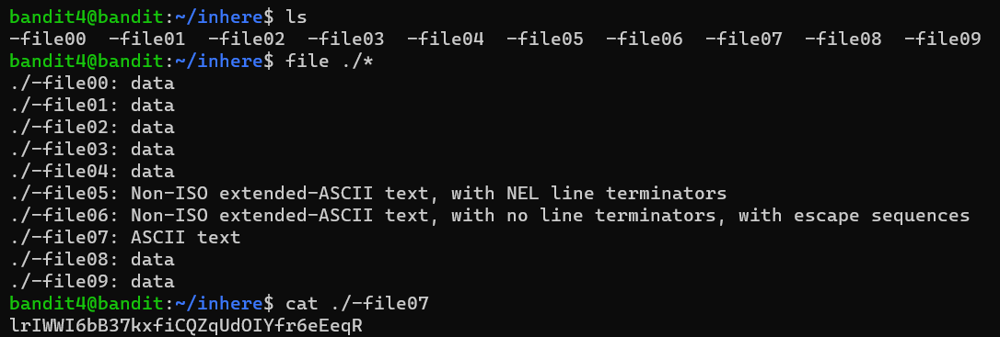

### Level 5

Nesse nível é informado que o arquivo contém texto legível, 1033 bytes e não é executável. Com o comando find é possível buscar por certos atributos como tamanho, então utilizando o parâmetro "-size 1033c" podemos buscar por arquivo com o tamanho de 1033 bytes. O ponto final após o find indica que deve começar a buscar a partir do diretório atual e ir recursivamente em todos os diretórios. **P4L4vucdmLnm8I7Vl7jG1ApGSfjYKqJU**

### Level 6

Agora foi informado que o arquivo pertence ao usuário bandit7 e ao grupo bandit6. Também com o find podemos buscar por arquivos de determinados usuários ou grupos, o "/" indica para buscar a partir da raiz do sistema de arquivos. **z7WtoNQU2XfjmMtWA8u5rN4vzqu4v99S**

### Level 7

Na home deste usuário possui um arquivo chamado "data.txt" que contém mais de 98 mil linhas. É informado que a senha está próxima a palavra "millionth", então podemos utilizar o grep para filtrar por essa palavra. **TESKZC0XvTetK0S9xNwm25STk5iWrBvP**

### Level 8

No arquivo "data.txt", agora tem várias strings com formato parecido com a senha, mas a senha é a que não se repete. Utilizando o sort podemos ordenar o arquivo para agrupar os repetidos, então com o uniq será impresso na tela apenas uma vez cada e o parâmetro "-c" informa quantas vezes aquela linha está presente. 

Com isso a senha é a única linha que terá 1 ocorrência e não 10 como as demais. **EN632PlfYiZbn3PhVK3XOGSlNInNE00t**

### Level 9

Na home temos um "data.txt" que é não é realmente um arquivo de texto, mas a senha será um texto legível dentro desse arquivo e está precedida por alguns sinais de igual "=". O comando strings é capaz de buscar por textos legíveis dentro de um arquivo binário. **G7w8LIi6J3kTb8A7j9LgrywtEUlyyp6s**

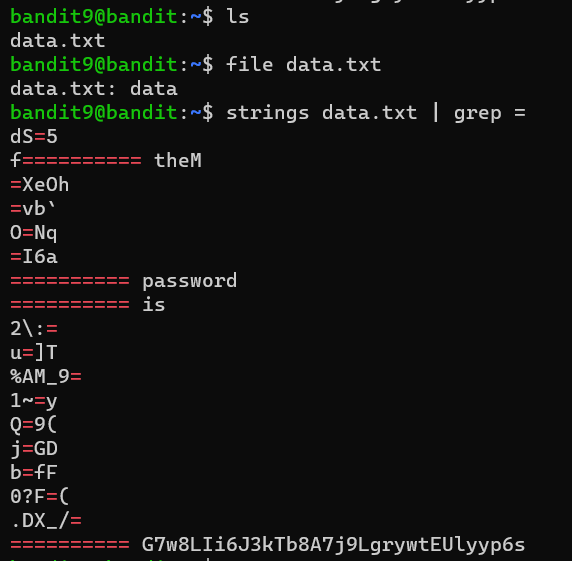

### Level 10

O arquivo "data.txt" agora contém um texto que está codificado em Base64, para decodificar há o parâmetro "-d" no comando base64. **6zPeziLdR2RKNdNYFNb6nVCKzphlXHBM**

### Level 11

Agora o texto está codificado utilizando ROT13, que são as letras deslocadas 13 posições no alfabeto. O site CyberChef possui várias operações que podem ser realizadas em texto sendo uma delas ROT13. **JVNBBFSmZwKKOP0XbFXOoW8chDz5yVRv**

### Level 12

O "data.txt" desse nível é um hexdump de um arquivo que foi comprimido várias vezes por diferentes algoritmos de compressão. Para resolver esse eu criei uma pasta no diretório /tmp para armazenar os arquivos que fui descomprimindo.

Primeiro para ir de hexdump para arquivo binário é só utilizar o comando xxd com o parâmetro "-r", assim conseguimos o primeiro arquivo que está comprimido em gzip. Para descomprimir de gzip, há o comando gunzip, porém o nome do arquivo deve terminar com o sufixo .gz para que seja possível descomprimir.

Depois de descomprimir o gzip conseguimos um arquivo comprimido em bzip2, que pode ser descomprimido com o bunzip2. Então, de novo, obtivemos um arquivo de gzip. Descomprimindo resulta em um arquivo comprimido duas vezes em tar, para descomprimir basta utilizar o comando tar com os parâmetros "-xf". Com isso vem novamente um bzip2.

Descompactando novamente de tar e de gzip conseguimos, finalmente, um arquivo de texto que contém a senha para o próximo nível. **wbWdlBxEir4CaE8LaPhauuOo6pwRmrDw**

### Level 13

Diferente dos níveis anteriores, nesse não coseguimos a senha, entretanto conseguimos a chave privada do SSH. 

Copiando a chave e alterando as permissões dela podemos usá-la como argumento para o parâmetro "-i" do SSH, dessa forma não sendo necessário inserir a senha.

### Level 14

As senhas de todos os níveis são armazenadas em arquivos no "/etc/bandit_pass" porém apenas o próprio usuário tem a permissão de ver a senha. Como para esse nível entramos com a chave SSH não conseguimos a senha dele e vamos precisar dela para avançar. **fGrHPx402xGC7U7rXKDaxiWFTOiF0ENq**

Para conseguir a senha do próximo nível é informado que precisaremos enviar a desse nível para um serviço que está escutando na porta 30000 desse servidor. Utilizando o netcat para fazer a conexão enviamos a senha atual e é retornado a próxima. **jN2kgmIXJ6fShzhT2avhotn4Zcka6tnt**

### Level 15

Esse nível é igual ao anterior, mas agora a conexão precisa ser encriptada utilizando o SSL. Ao invés do netcat que usa telnet, usaremos o s_client do openssl para fazer a conexão. Depois é só enviar a senha atual que retorna a próxima. **JQttfApK4SeyHwDlI9SXGR50qclOAil1**

### Level 16

Agora precisamos fazer o mesmo que no anterior mas não é informada a porta. Foi informado que está entre a 31000 e a 32000, sendo que alguns serviços nessa faixa apenas retornam o que foi enviado e um deles retorna a senha. 

Utilizando o nmap com o parâmetro "-sV" podemos ver o que está sendo executado em cada porta. Apenas na 31790 não é echo, então é essa que precisamos. 

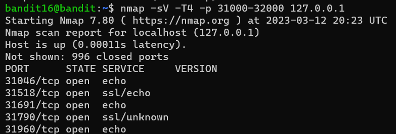

Ao enviar a senha é retornada a chave SSH privada.

### Level 17

No diretório home do bandit17 há dois arquivos com senhas, um chamado "passwords.new" e outro "passwords.old", a senha que procuramos é a única que foi modificada no new. Utilizando o comando diff podemos ver as diferenças entre os dois arquivos. Na linha 42 houve uma alteração entre os dois arquivos, sendo a nova senha **hga5tuuCLF6fFzUpnagiMN8ssu9LFrdg**.

### Level 18

Ao tentar logar com o SSH somos desconectados, nesse nível. Para que possamos executar comandos na máquina podemos colocá-los após o comando do ssh, assim quando digitarmos a senha o comando será executado na máquina. **awhqfNnAbc1naukrpqDYcF95h7HoMTrC**

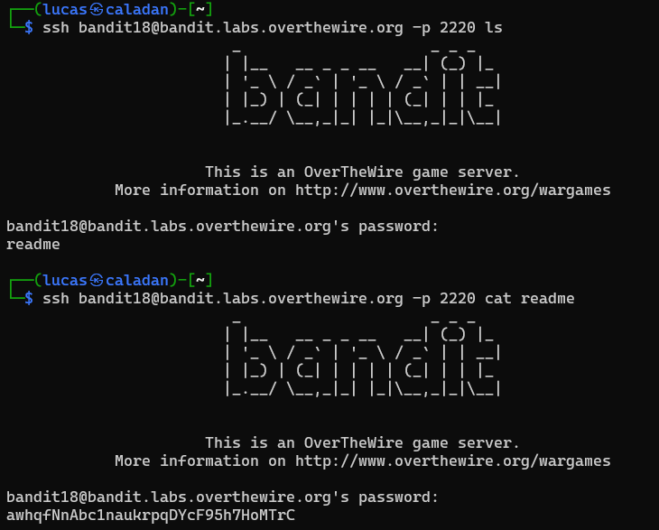

### Level 19

No diretório home agora temos um executável que nos permite executar os comandos como sendo o bandit20. Com esse programa podemos ler a senha do bandit20 armazenada no "/etc/bandit_pass/bandit20". **VxCazJaVykI6W36BkBU0mJTCM8rR95XT**

### Level 20

O executável que temos agora faz a conexão com alguma porta que seja passada como argumento e caso receba a senha desse nível ele responderá com a senha do próximo. Então para resolver esse desafio precisei conectar na máquina em duas sessões do SSH, em uma delas eu coloquei o netcat para escutar na porta 1234 e na outra utilizei esse executável para fazer a conexão.

Primeiro coloquei netcat para escutar utilizando os parâmetros "-lnvp", onde l é para escutar, n para não resolver o nome do DNS para ip, v para mostrar mais detalhes e p para especificar a porta.

Depois que o netcat estava ouvindo pude conectar utilizando o suconnect.

Quando o netcat recebeu a conexão, enviei a senha atual e assim recebi a próxima. **NvEJF7oVjkddltPSrdKEFOllh9V1IBcq**

### Level 21

O bandit22 possui uma tarefa que está agendada para executar o script "/usr/bin/cronjob_bandit22.sh" a todo minuto. Olhando o script vemos que está copiando a senha para um arquivo no diretório tmp e está dando permissão para todos lerem. **WdDozAdTM2z9DiFEQ2mGlwngMfj4EZff**

### Level 22

Nesse também precisamos olhar um script que está sendo executado com o cron. Esse script copia senha do próprio usuário para um arquivo que o nome é o hash do nome do usuário. Calculando o hash do bandit23 conseguimos printar a senha dele. **QYw0Y2aiA672PsMmh9puTQuhoz8SyR2G**

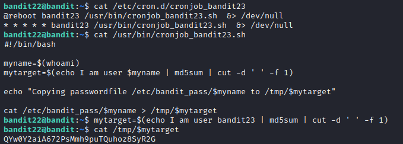

### Level 23

Como os dois anteriores, nesse também há uma tarefa definida no cron. O script desse irá executar e depois deletar todos os scripts que estiverem na pasta "/var/spool/bandit24/foo". Dessa forma, se colocarmos algum script nesse diretório ele será executado como sendo o bandit24, que é quem criou o cronjob.

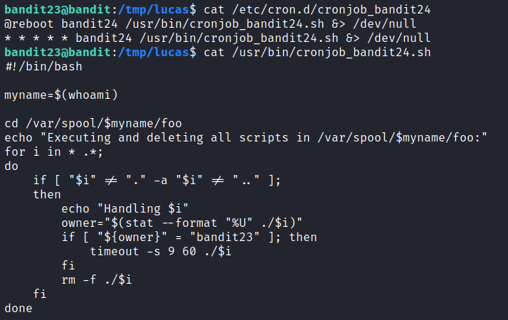

Para conseguir a senha, eu criei um script que irá ler o conteúdo do "/etc/bandit_pass/bandit24" e escrevê-lo em um arquivo que eu criei no "/tmp/lucas/senha". Dei permissão para que todos os usuários possam executar ou escrever nesses arquivos, logo o bandit24 poderá executar o script que escreverá no arquivo. E por fim copiei o senha.sh para o arquivo que será executado. 

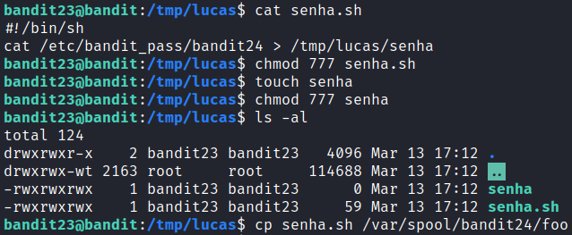

Após alguns segundos a tarefa é executada rodando o script que eu criei. Com um cat podemos ver que a senha está no arquivo. **VAfGXJ1PBSsPSnvsjI8p759leLZ9GGar**

### Level 24

Nesse nível há um serviço sendo executado na porta 30002 que retornará a senha do próximo caso seja inserido a senha atual e um pin de 4 dígitos. Precisaremos fazer um brute-force para descobrir o pin, já que pode ser qualquer número de 4 dígitos.

Para não precisar testar as 10 mil possibilidades na mão, eu criei um script que faça isso. O loop do for irá criar um arquivo chamado "pins" que cada linha terá a senha atual e uma opção de pin. Depois será realizado a conexão utilizando o netcat e enviado uma linha por vez, e o grep filtrará para que não apareçam as mensagens de que o pin está errado. **p7TaowMYrmu23Ol8hiZh9UvD0O9hpx8d**

### Level 25

Na home do bandit25 há a chave SSH privada do bandit26 mas ao logar é impresso o texto de aviso na tela e a conexão acaba. Isso acontece pois a shell do bandit26 não é o bash, mas um script para printar o texto com o more.

Caso o tamanho do terminal não seja o suficiente o more irá parar de printar o texto, dando tempo para a gente executar alguns comandos. 

Clicando "v" poderemos executar comandos no vim. E com ":set shell=/bin/bash|:shell" conseguiremos uma shell como bandit26. **c7GvcKlw9mC7aUQaPx7nwFstuAIBw1o1**

### Level 26

Agora que temos uma shell interativa como bandit26 podemos prosseguir. Na home há um programa que nos permite executar comandos como bandit27. Com esse programa e com cat podemos ver a senha do bandit27 armazenada. **YnQpBuifNMas1hcUFk70ZmqkhUU2EuaS**

### Level 27

Há um repositório de git do usuário bandit27-git que a senha é a mesma que do bandit27. Clonando esse repositório encontramos a senha do próximo armazenada em um arquivo "README". **AVanL161y9rsbcJIsFHuw35rjaOM19nR**

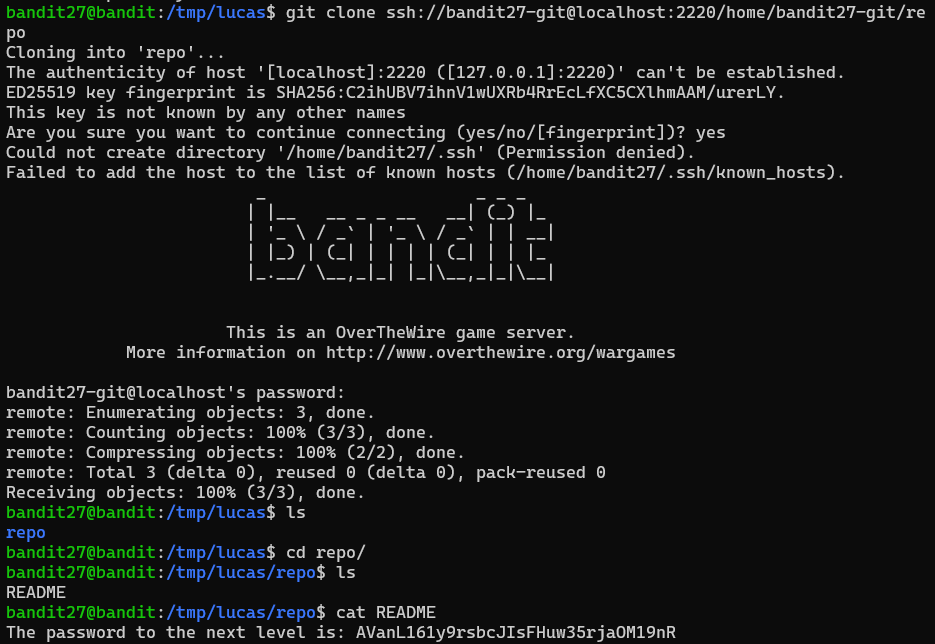

### Level 28

Como o anterior, esse também tem um repositório de git, mas a senha não está sendo mostrada.

Utilizando o comando git log podemos ver o log de todas as alterações que foram realizadas no repositório. Com o git show vemos quais foram as mudanças realizadas em cada commit. No primeiro deles foi retirada a senha e adicionado os X. **tQKvmcwNYcFS6vmPHIUSI3ShmsrQZK8S**

### Level 29

Novamente um repositório de git. Agora a senha também não está no "README.md". Mas é informado que não tem senha em produção, logo pode haver alguma em uma branch de desenvolvimento. Olhando as branchs encontramos algumas, sendo uma delas chamada "dev", ao alterar para esse encontramos a senha. **xbhV3HpNGlTIdnjUrdAlPzc2L6y9EOnS**

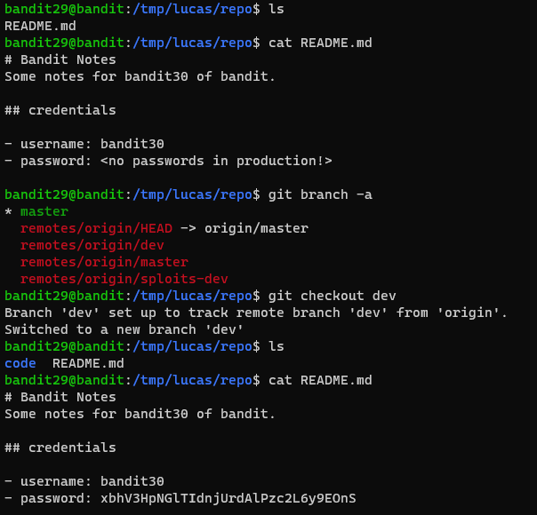

### Level 30

Nesse nível o repositório só possui um arquivo "README.md" e não há nenhum outro commit ou branch. Mas há uma tag na qual está a senha. **OoffzGDlzhAlerFJ2cAiz1D41JW1Mhmt**

### Level 31

Por fim o último de git, o "README.md" explica que precisamos fazer o push de um arquivo chamado "key.txt" com o contúdo "May I come in?" para o repositório. Como o ".gitignore" contém *.txt nenhum aquivo com essa extensão poderá ser adicionado, mas isso pode ser ignorado se usarmos o parâmetro "-f" no git add.

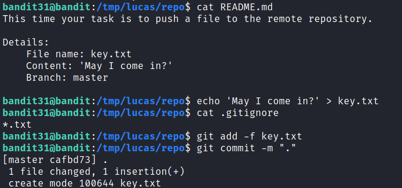

Depois é só fazer o commit e o push e é retornada a senha. **rmCBvG56y58BXzv98yZGdO7ATVL5dW8y**

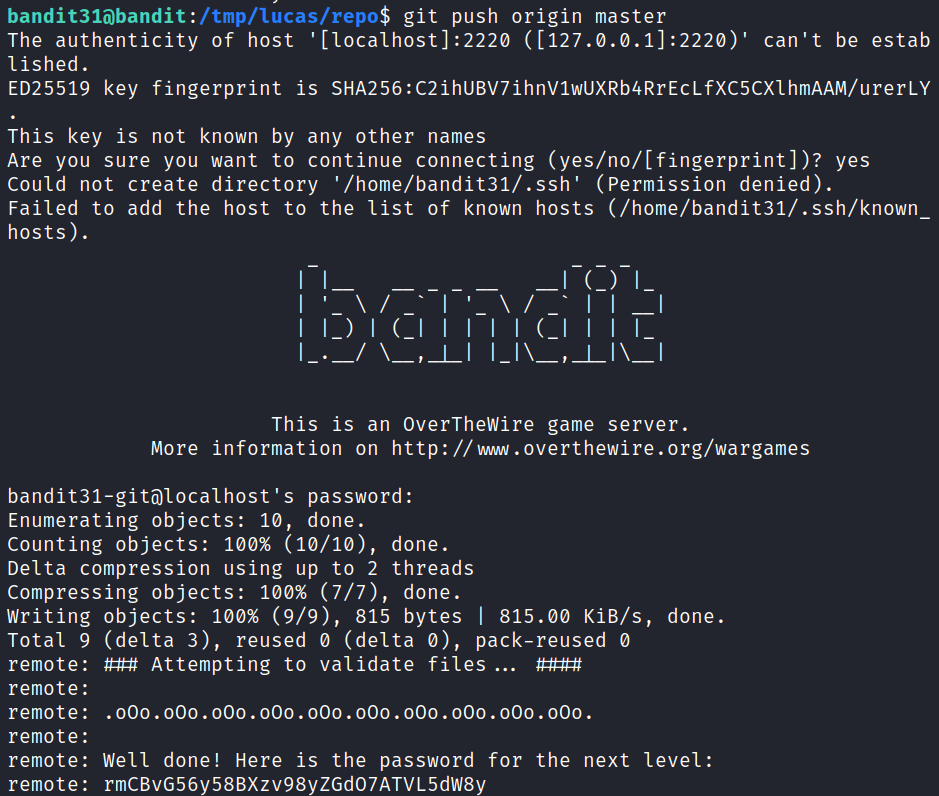

### Level 32

No último desafio somos colocados em uma shell que converte todas as letras para maiúsculas, então não conseguimos utilizar os comandos pois esses são escritos com letras minúsculas. A variável "0", por padrão, armazena o comando para executar a shell. Então utilizando "$0" nenhum dos caracteres será alterado e o interpretador entenderá que queremos executar "sh", assim obtemos uma shell normal. **odHo63fHiFqcWWJG9rLiLDtPm45KzUKy**

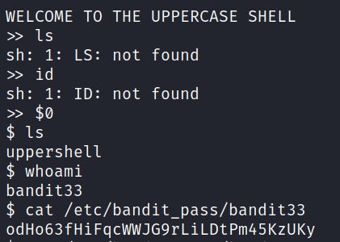

## Conclusão

Aqui terminamos todos os 33 níveis que existem até o momento. Como pode ser visto todos foram sobre comandos básicos de Linux, visto que é um desafio para quem está iniciando. O OverTheWire possui outros Wargames que pretendo fazer o write-up no futuro.

Agradeço a todos que leram. Qualquer dúvida ou sugestão de melhoria é só entrar em contato.

 

---
Lucas Tomio Darim