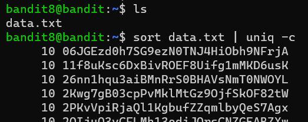
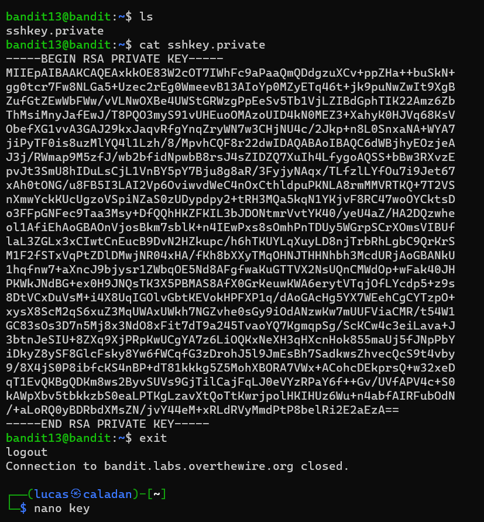
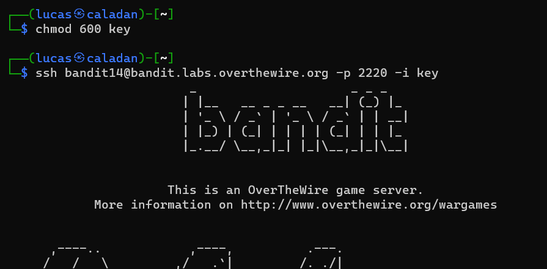
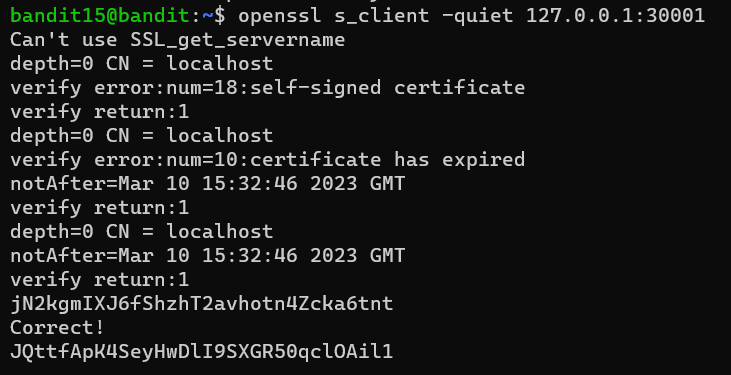
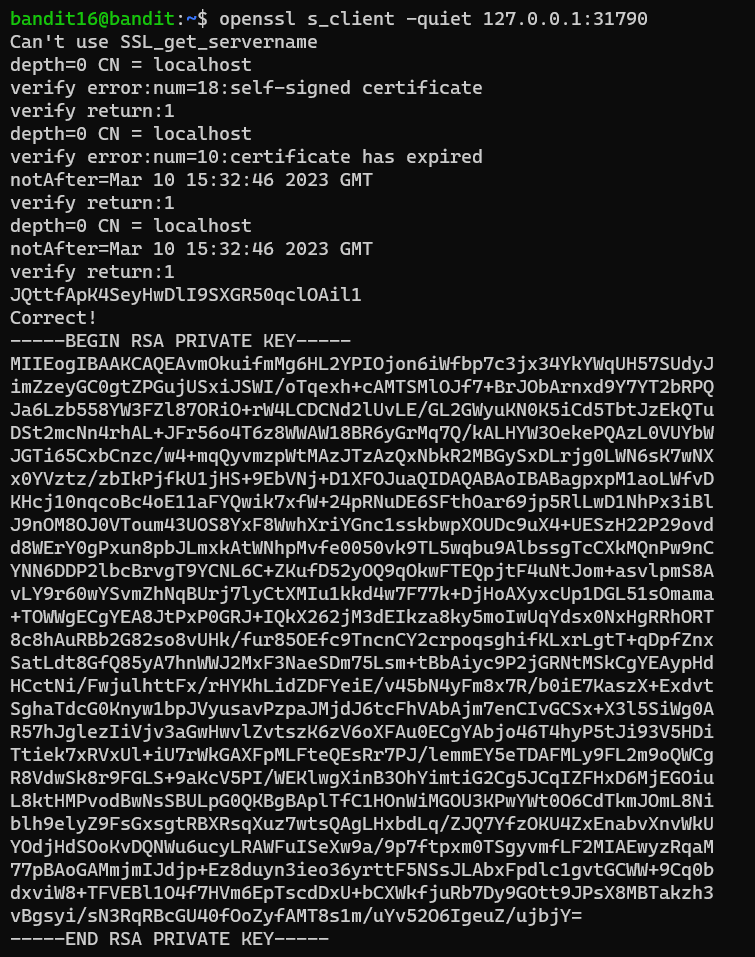

# Bandit

Bandit é um dos wargames do OverTheWire, ele tem a intenção de ensinar o básico de Linux para quem está começando a aprender. São 33 níveis onde é preciso encontrar a senha do SSH do próximo nível, que está escondida na máquina, para avançar.

Este desafio pode ser acessado por meio de SSH no servidor bandit.labs.overthewire.org na porta 2220.

### Level 0

As credenciais para acessar no nível 0 para começar são fornecidas, sendo usuário bandit0 e senha também bandit0.

Na home deste usuário já encontramos a senha para o próximo nível no arquivo chamado "readme", **NH2SXQwcBdpmTEzi3bvBHMM9H66vVXjL**.

### Level 1

Agora a senha também está em um arquivo na home, porém o arquivo se chama "-". Para conseguir printar o conteúdo deste precisa-se passar o caminho com "./-", caso coloque apenas "-" o interpretador do bash espera por algum parâmetro. A senha encontrada é **rRGizSaX8Mk1RTb1CNQoXTcYZWU6lgzi**.

### Level 2

Nesse nível o nome do arquivo possui espaços, para printar podemos utilizar tanto o contrabarra "\", como aspas no nome. **aBZ0W5EmUfAf7kHTQeOwd8bauFJ2lAiG**

### Level 3

Caso o nome do arquivo começe com ponto final "." ele não será mostrado com o comando ls normal, será necessário adicionar o parâmetro "-a". **2EW7BBsr6aMMoJ2HjW067dm8EgX26xNe**

### Level 4

Agora temos uma pasta com vários arquivo, mas a maioria deles não possui como conteúdo textos. Então utilizando o comando file podemos ver o tipo de conteúdo do arquivo e o asterisco "*" é um coringa que retorna todas as possíveis combinações.

Com isso podemos ver que apenas o arquivo "-file07" possui texto com o padrão ASCII. **lrIWWI6bB37kxfiCQZqUdOIYfr6eEeqR**

### Level 5

Nesse nível é informado que o arquivo contém texto legível, 1033 bytes e não é executável. Com o comando find é possível buscar por certos atributos como tamanho, então utilizando o parâmetro "-size 1033c" podemos buscar por arquivo com o tamanho de 1033 bytes. O ponto final após o find indica que deve começar a buscar a partir do diretório atual e ir recursivamente em todos os diretórios. **P4L4vucdmLnm8I7Vl7jG1ApGSfjYKqJU**

### Level 6

Agora foi informado que o arquivo pertence ao usuário bandit7 e ao grupo bandit6. Também com o find podemos buscar por arquivos de determinados usuários ou grupos, o "/" indica para buscar a partir da raiz do sistema de arquivos. **z7WtoNQU2XfjmMtWA8u5rN4vzqu4v99S**

### Level 7

Na home deste usuário possui um arquivo chamado "data.txt" que contém mais de 98 mil linhas. É informado que a senha está próxima a palavra "millionth", então podemos utilizar o grep para filtrar por essa palavra. **TESKZC0XvTetK0S9xNwm25STk5iWrBvP**

### Level 8

No arquivo "data.txt", agora tem várias strings com formato parecido com a senha, mas a senha é a que não se repete. Utilizando o sort podemos ordenar o arquivo para agrupar os repetidos, então com o uniq será impresso na tela apenas uma vez cada e o parâmetro "-c" informa quantas vezes aquela linha está presente. 

Com isso a senha é a única linha que terá 1 ocorrência e não 10 como as demais. **EN632PlfYiZbn3PhVK3XOGSlNInNE00t**

### Level 9

Na home temos um "data.txt" que é não é realmente um arquivo de texto, mas a senha será um texto legível dentro desse arquivo e está precedida por alguns sinais de igual "=". O comando strings é capaz de buscar por textos legíveis dentro de um arquivo binário. **G7w8LIi6J3kTb8A7j9LgrywtEUlyyp6s**

### Level 10

O arquivo "data.txt" agora contém um texto que está codificado em Base64, para decodificar há o parâmetro "-d" no comando base64. **6zPeziLdR2RKNdNYFNb6nVCKzphlXHBM**

### Level 11

Agora o texto está codificado utilizando ROT13, que são as letras deslocadas 13 posições no alfabeto. O site CyberChef possui várias operações que podem ser realizadas em texto sendo uma delas ROT13. **JVNBBFSmZwKKOP0XbFXOoW8chDz5yVRv**

### Level 12

O "data.txt" desse nível é um hexdump de um arquivo que foi comprimido várias vezes por diferentes algoritmos de compressão. Para resolver esse eu criei uma pasta no diretório /tmp para armazenar os arquivos que fui descomprimindo.

Primeiro para ir de hexdump para arquivo binário é só utilizar o comando xxd com o parâmetro "-r", assim conseguimos o primeiro arquivo que está comprimido em gzip. Para descomprimir de gzip, há o comando gunzip, porém o nome do arquivo deve terminar com o sufixo .gz para que seja possível descomprimir.

Depois de descomprimir o gzip conseguimos um arquivo comprimido em bzip2, que pode ser descomprimido com o bunzip2. Então, de novo, obtivemos um arquivo de gzip. Descomprimindo resulta em um arquivo comprimido duas vezes em tar, para descomprimir basta utilizar o comando tar com os parâmetros "-xf". Com isso vem novamente um bzip2.

Descompactando novamente de tar e de gzip conseguimos, finalmente, um arquivo de texto que contém a senha para o próximo nível. **wbWdlBxEir4CaE8LaPhauuOo6pwRmrDw**

### Level 13

Diferente dos níveis anteriores, nesse não coseguimos a senha, entretanto conseguimos a chave privada do SSH. 

Copiando a chave e alterando as permissões dela podemos usá-la como argumento para o parâmetro "-i" do SSH, dessa forma não sendo necessário inserir a senha.

### Level 14

As senhas de todos os níveis são armazenadas em arquivos no "/etc/bandit_pass" porém apenas o próprio usuário tem a permissão de ver a senha. Como para esse nível entramos com a chave SSH não conseguimos a senha dele e vamos precisar dela para avançar. **fGrHPx402xGC7U7rXKDaxiWFTOiF0ENq**

Para conseguir a senha do próximo nível é informado que precisaremos enviar a desse nível para um serviço que está escutando na porta 30000 desse servidor. Utilizando o netcat para fazer a conexão enviamos a senha atual e é retornado a próxima. **jN2kgmIXJ6fShzhT2avhotn4Zcka6tnt**

### Level 15

Esse nível é igual ao anterior, mas agora a conexão precisa ser encriptada utilizando o SSL. Ao invés do netcat que usa telnet, usaremos o s_client do openssl para fazer a conexão. Depois é só enviar a senha atual que retorna a próxima. **JQttfApK4SeyHwDlI9SXGR50qclOAil1**

### Level 16

Agora precisamos fazer o mesmo que no anterior mas não é informada a porta. Foi informado que está entre a 31000 e a 32000, sendo que alguns serviços nessa faixa apenas retornam o que foi enviado e um deles retorna a senha. 

Utilizando o nmap com o parâmetro "-sV" podemos ver o que está sendo executado em cada porta. Apenas na 31790 não é echo, então é essa que precisamos. 

Ao enviar a senha é retornada a chave SSH privada.

### Level 17

No diretório home do bandit17 há dois arquivos com senhas, um chamado "passwords.new" e outro "passwords.old", a senha que procuramos é a única que foi modificada no new. Utilizando o comando diff podemos ver as diferenças entre os dois arquivos. Na linha 42 houve uma alteração entre os dois arquivos, sendo a nova senha **hga5tuuCLF6fFzUpnagiMN8ssu9LFrdg**.

### Level 18

Ao tentar logar com o SSH somos desconectados, nesse nível. Para que possamos executar comandos na máquina podemos colocá-los após o comando do ssh, assim quando digitarmos a senha o comando será executado na máquina. **awhqfNnAbc1naukrpqDYcF95h7HoMTrC**

### Level 19

No diretório home agora temos um executável que nos permite executar os comandos como sendo o bandit20. Com esse programa podemos ler a senha do bandit20 armazenada no "/etc/bandit_pass/bandit20". **VxCazJaVykI6W36BkBU0mJTCM8rR95XT**

### Level 20

O executável que temos agora faz a conexão com alguma porta que seja passada como argumento e caso receba a senha desse nível ele responderá com a senha do próximo. Então para resolver esse desafio precisei conectar na máquina em duas sessões do SSH, em uma delas eu coloquei o netcat para escutar na porta 1234 e na outra utilizei esse executável para fazer a conexão.

Primeiro coloquei netcat para escutar utilizando os parâmetros "-lnvp", onde l é para escutar, n para não resolver o nome do DNS para ip, v para mostrar mais detalhes e p para especificar a porta.

Depois que o netcat estava ouvindo pude conectar utilizando o suconnect.

Quando o netcat recebeu a conexão, enviei a senha atual e assim recebi a próxima. **NvEJF7oVjkddltPSrdKEFOllh9V1IBcq**

### Level 21

### Level 22

### Level 23

### Level 24

### Level 25

### Level 26

### Level 27

### Level 28

### Level 29

### Level 30

### Level 31

### Level 32

### Level 33

 

---
Lucas Tomio Darim